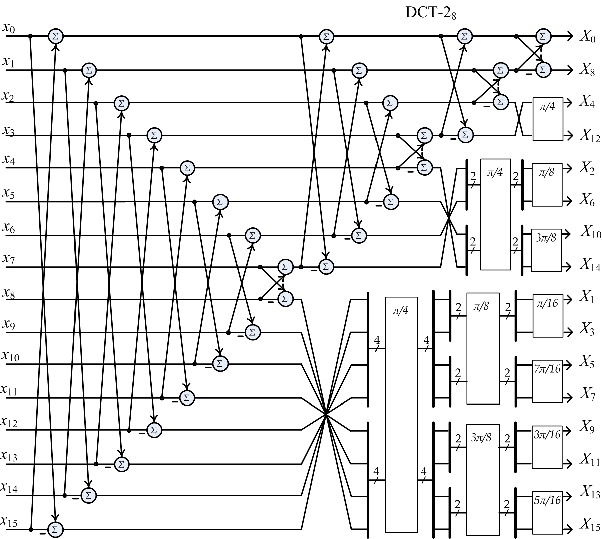
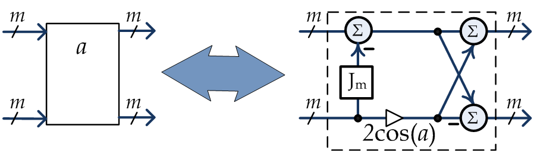

# A low multiplicative complexity fast recursive DCT-2 algorithm

## Intro
This repository contains source MATLAB code of the fast DCT-2/DCT-4 recursive algorithm desribed in paper 
**Vashkevich, M., & Petrovsky, A. (2012). [A low multiplicative complexity fast recursive DCT-2 algorithm](https://arxiv.org/pdf/1203.3442.pdf). arXiv preprint arXiv:1203.3442.**

## Block scheme of Fast 16-point DCT-2 algorithm
<div style="text-align: center;">

</div>
<p style="text-align: center;"> Fig 1. Fast 16-point DCT-2 </p>

### Building block
<div style="text-align: center;">

</div>
<p style="text-align: center;"> Fig 2. Building block of the fast DCT algorithm </p>

## Source code
Source code is given in the ```matlab``` folder. Here is a brief desciption of the code:
- ```main.m``` -- main demo file
- ```dct2_recursive.m``` -- implementation of DCT-2 (fig. 1) 
- ```dct4_recursive.m``` -- implementation of DCT-4, that exists inside DCT-2;
- ```fastDCT_bb.m``` -- basic building block of the algorithm (fig. 2);
- ```stride_perm.m``` -- generation stride permutation matrix.

### DCT basis generated by the fast algorithm
<div style="text-align: center;">

</div>
<p style="text-align: center;"> Fig 3. 8-point DCT-2 basis</p>

